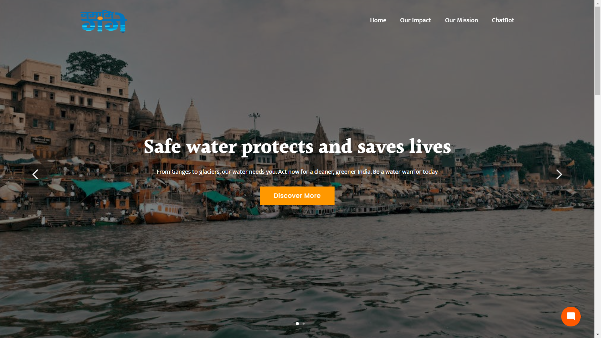
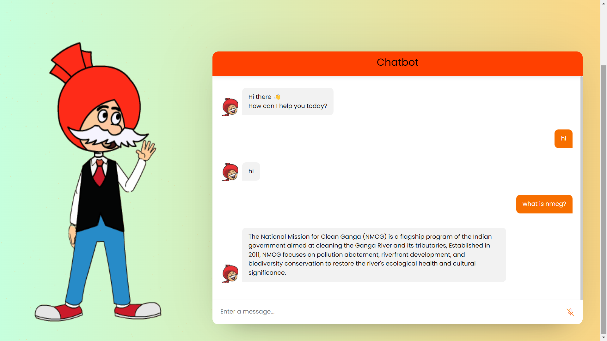
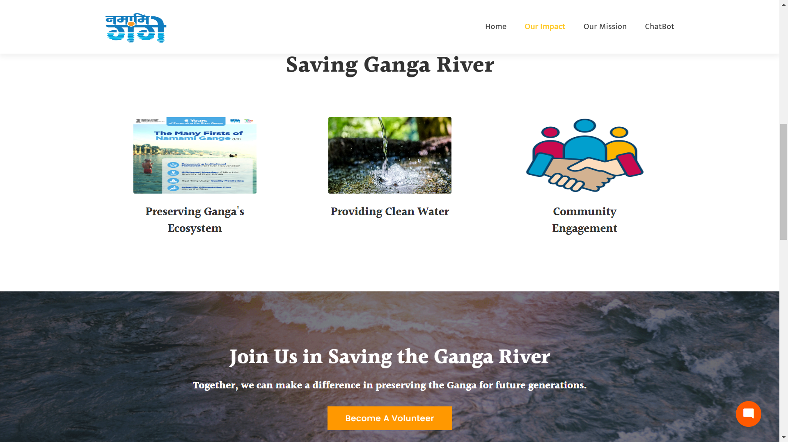

# NMCG Interactive Mascot and Digital Avatar
# NMCG CHATBOT
A Chatbot application for Ganga Cleaning Awareness Campaign.
# Visit our webpage at: 
https://nmcg-chatbot.onrender.com

## Overview
This project aims to create an AI, ML & Chatbot powered interactive mascot, Chacha Chaudhary, and digital avatar to raise awareness and disseminate information about the Namami Gange Programme. The mascot is designed to interact with people of all ages and backgrounds, making it a fun and engaging way to learn about the importance of river conservation.

The application will be deployed at the entrance of the River Basin War Room & Ganga Museum, as well as on the NMCG website in the coming future.
=======
# Getting Started
  ####  Technology Used
- HTML
- CSS
- BOOTSTRAP 5
- PYTHON
- JAVASCRIPT
- ADOBE ANIMATE
- GOOGLE GEMINI API
 ####  Installation
* There is no need to install this Application.You just need to follow through our Website.
* There must be minimum requirement of operating system to access this website.
  For Windows: Windows 10
  For Mac OS:Mac M! architecture

## Features
- **There are many features and functionalities of this project.The main and important features are listed below:-**
- **Interactive Mascot**: Chacha Chaudhary, the digital avatar, interacts with users to provide information about the Namami Gange Programme.
- **AI and ML Integration**: Uses artificial intelligence and machine learning to respond to user queries effectively.
- **Chatbot Functionality**: Allows users to engage in conversations with the mascot for an interactive learning experience.
- **Educational Content**: Provides information suitable for school children, the common man, and other stakeholders.

## Technologies Used
- **Backend**: Flask
- **Frontend**: HTML, CSS, JavaScript, jQuery
- **AI/ML**: Python libraries for AI and ML integration such as RAG,Llama-2
=======
# Authors
- K.Koushik Reddy (https://github.com/Kaushik0126)
- B.R.Sohith Kumar Reddy (https://github.com/Sohith-reddy)
- Chilivery Sripad (https://github.com/Sripad1003)
- M.Sree Charan Reddy (https://github.com/sreecharan1306)
- P.Sreenadh Reddy (https://github.com/Sreenadh3)
- A.Sudheep Bhaskar (https://github.com/Heisenberg09Xd)

## Installation

### Prerequisites
- Python 3.9 or higher
- Flask
- Other dependencies/library modules listed in `requirements.txt`

### Steps

- **Run our application using the given following commands:-**

1. **Clone the repository**:
    ```sh
    git clone [https://github.com/Sohith-reddy/NMCG_BOT.git]
    cd NMCG
    ```

2. **Install dependencies**:
    ```sh
    pip install -r requirements.txt
    ```

3. **Run the application u**:
    ```sh
    python app.py
    ```

## Project Structure

- `app.py`: Main application file written with Flask ,a popular REST API service written in Python.
- `sk.py`: Additional script file for handling specific functionalities.
- `templates/`: Contains HTML templates.
- `static/`: Contains static files like CSS, JS, and images.
- `requirements.txt`: Lists all Python dependencies and libraries required.
- `text.txt`: Additional text resources.
- `README.md`: Project documentation or Details regarding the functionality of this application program.

## Usage

After starting the Flask server, navigate to `http://127.0.0.1:5000` in your web browser to interact with the mascot and explore the functionalities.

## Live Demo

Check out the live demo of our application [here](https://nmcg-chatbot.onrender.com/).

## Screenshots

### Home Page


### Interaction with Mascot


### Our Impact


## Contributing

Contributions are welcome! Please fork the repository and create a pull request with your changes.

## Team Members

- **B. R. Sohith Kumar Reddy** - [GitHub](https://github.com/Sohith-reddy)
- **K. Koushik Reddy** - [GitHub](https://github.com/Kaushik0126)
- **Chilivery Sripad** - [GitHub](https://github.com/Sripad1003)
- **A. Sudheep Bhaskar** - [GitHub](https://github.com/Heisenberg09Xd)
- **M. Sree Charan Reddy** - [GitHub](https://github.com/sreecharan1306)
- **P. Sreenadh Reddy** - [GitHub](https://github.com/Sreenadh3)

## Contact

For any queries, please contact [NMCG](mailto:nmcgchatbot@gmail.com).
=======
# Licensing
This Project is done and licensed by Team Ganga.

